# The Smart Corporate Search 🤖

An intelligent internal RAG (Retrieval Augmented Generation) application that allows you to query your internal systems using natural language. Ask questions like "Who is our biggest customer by total revenue?" and get instant answers with detailed analysis, interactive charts, and actionable business insights powered by AI agents and your corporate data.

## ✨ Key Features

- **Natural Language Queries**: Ask complex business questions in plain English
- **Intelligent Analysis**: AI agents provide detailed insights and contextual analysis
- **Interactive Charts**: Automatic visualization generation for trends, comparisons, and distributions
- **Sequential Agent Architecture**: Specialized agents for data retrieval and presentation
- **Real-time Chat Interface**: Streamlit-powered frontend with persistent chat history
- **SQL Tool Integration**: MCP toolbox with comprehensive database operations

## 🏗️ Architecture

This project consists of four main components that work together to deliver intelligent corporate search capabilities:

### System Overview

```mermaid
graph LR
    User[👤 User] --> Frontend[🖥️ Frontend<br/>Streamlit<br/>Port 8501]
    Frontend --> AIAgent[🤖 AI Agent<br/>FastAPI + Google ADK<br/>Port 8080]
    AIAgent --> MCPToolbox[🔧 MCP Toolbox<br/>SQL Tools Server<br/>Port 8081]
    MCPToolbox --> Database[🗄️ PostgreSQL<br/>Corporate Data<br/>Port 5432]

    AIAgent --> Gemini[✨ Google AI<br/>Gemini Models]

    style Frontend fill:#e1f5fe,stroke:#01579b,stroke-width:2px,color:#000
    style AIAgent fill:#f3e5f5,stroke:#4a148c,stroke-width:2px,color:#000
    style MCPToolbox fill:#e8f5e8,stroke:#1b5e20,stroke-width:2px,color:#000
    style Database fill:#fff3e0,stroke:#e65100,stroke-width:2px,color:#000
    style Gemini fill:#fce4ec,stroke:#880e4f,stroke-width:2px,color:#000
    style User fill:#f5f5f5,stroke:#424242,stroke-width:2px,color:#000
```



### Sequential Agent Architecture

```mermaid
sequenceDiagram
    participant U as 👤 User
    participant F as 🖥️ Frontend
    participant R as 🔍 Retriever Agent
    participant P as 📊 Presenter Agent
    participant M as 🔧 MCP Toolbox
    participant D as 🗄️ Database
    participant G as ✨ Gemini AI

    U->>F: "Who is our biggest customer?"
    F->>R: Process natural language query
    R->>G: Generate SQL analysis plan
    G-->>R: SQL query strategy
    R->>M: Execute SQL tools
    M->>D: Query corporate data
    D-->>M: Return results
    M-->>R: Formatted data response
    R->>P: Pass data context
    P->>G: Generate insights + visualizations
    G-->>P: Analysis + Vega-Lite charts
    P-->>F: Complete response with charts
    F-->>U: Interactive analysis + charts
```



### Components

- **Frontend (Port 8501)**: Streamlit-based chat interface with interactive chart rendering, persistent chat history, and real-time response streaming
- **AI Agent (Port 8080)**: FastAPI application powered by Google ADK featuring sequential agent architecture with specialized retriever and presenter agents for data analysis and visualization
- **MCP Toolbox (Port 8081)**: Model Context Protocol server with comprehensive SQL tools including KPI analysis, trend analysis, customer insights, and product analytics
- **PostgreSQL (Port 5432)**: Database containing your corporate data with sample e-commerce dataset for testing and development

## 🚀 Quick Start

### Prerequisites

- Docker and Docker Compose
- Google AI API Key (Gemini)
- For cloud deployment: Google Cloud Project with billing enabled

### Setup

1. **Clone the repository**

   ```bash
   git clone git@github.com:discoverlance-com/the-smart-corporate-search.git
   cd the-smart-corporate-search
   ```

2. **Configure your Google AI API Key**

   Edit `ai-agent/corporate_agent/.env`:

   ```env
   GOOGLE_API_KEY=your_google_ai_api_key_here
   GOOGLE_GENAI_USE_VERTEXAI=0
   ```

3. **Set your Google Cloud Project (Optional)**

   ```bash
   # Option 1: Environment variable
   export GOOGLE_CLOUD_PROJECT=your-project-id

   # Option 2: Create .env file in root directory
   echo "GOOGLE_CLOUD_PROJECT=your-project-id" > .env
   ```

4. **Start all services**

   ```bash
   docker-compose up --watch
   ```

5. **Access the application**
   - Frontend: [http://localhost:8501](http://localhost:8501)
   - AI Agent API: [http://localhost:8080](http://localhost:8080)
   - MCP Toolbox: [http://localhost:8081](http://localhost:8081)

## 🛠️ Development

The project is designed for easy development with **Docker Compose watch** for instant file synchronization:

### Environment Comparison

```mermaid
flowchart LR
    subgraph "🛠️ Development Environment"
        DevFrontend[🖥️ Frontend<br/>Docker + Watch<br/>localhost:8501]
        DevAI[🤖 AI Agent<br/>Docker + Watch<br/>localhost:8080]
        DevMCP[🔧 MCP Toolbox<br/>Docker<br/>localhost:8081]
        DevDB[(🗄️ PostgreSQL<br/>Docker Container<br/>localhost:5432)]
        DevSecrets[📄 .env Files<br/>Local Config]

        DevFrontend --> DevAI
        DevAI --> DevMCP
        DevMCP --> DevDB
        DevAI --> DevSecrets
    end

    subgraph "☁️ Production Environment"
        ProdFrontend[🖥️ Frontend<br/>Cloud Run<br/>Public Access]
        ProdAI[🤖 AI Agent<br/>Cloud Run<br/>Internal Only]
        ProdMCP[🔧 MCP Toolbox<br/>Cloud Run<br/>Internal Only]
        ProdDB[(🗄️ Cloud SQL<br/>PostgreSQL<br/>Private Network)]
        ProdSecrets[🔐 Secret Manager<br/>Volume Mounts]
        ProdVPC[🔗 VPC Network<br/>Private Connectivity]

        ProdFrontend --> ProdAI
        ProdAI --> ProdMCP
        ProdMCP --> ProdDB
        ProdVPC --> ProdFrontend
        ProdVPC --> ProdAI
        ProdVPC --> ProdMCP
        ProdVPC --> ProdDB
        ProdSecrets --> ProdAI
        ProdSecrets --> ProdMCP
    end

    DevMCP -.- ProdMCP
    DevAI -.- ProdAI
    DevFrontend -.- ProdFrontend

    style DevFrontend fill:#e1f5fe,stroke:#01579b,stroke-width:2px,color:#000
    style DevAI fill:#f3e5f5,stroke:#4a148c,stroke-width:2px,color:#000
    style DevMCP fill:#e8f5e8,stroke:#1b5e20,stroke-width:2px,color:#000
    style DevDB fill:#fff3e0,stroke:#e65100,stroke-width:2px,color:#000
    style DevSecrets fill:#f5f5f5,stroke:#424242,stroke-width:2px,color:#000
    style ProdFrontend fill:#b3e5fc,stroke:#0277bd,stroke-width:2px,color:#000
    style ProdAI fill:#e1bee7,stroke:#7b1fa2,stroke-width:2px,color:#000
    style ProdMCP fill:#c8e6c9,stroke:#2e7d32,stroke-width:2px,color:#000
    style ProdDB fill:#ffe0b2,stroke:#ef6c00,stroke-width:2px,color:#000
    style ProdVPC fill:#f0f0f0,stroke:#616161,stroke-width:2px,color:#000
    style ProdSecrets fill:#fce4ec,stroke:#880e4f,stroke-width:2px,color:#000
```



### Development Modes

#### Option 1: Docker Compose Watch (Recommended)

```bash
# Start all services with live file watching
docker-compose up --watch

# Or start services and watch separately for cleaner logs
docker-compose up -d
docker-compose watch
```

**Features:**

- ✅ **Instant Updates**: Code changes automatically sync to running containers
- ✅ **Smart Ignoring**: Excludes `__pycache__/`, `*.pyc`, `.venv/`, `.adk/` files
- ✅ **Selective Rebuilds**: Only rebuilds when `requirements.txt` changes
- ✅ **Performance Optimized**: Better than bind mounts with intelligent file filtering

#### Option 2: Traditional Development

```bash
# Standard build and run
docker-compose up --build

# Rebuild specific service after changes
docker-compose up --build ai-agent -d
```

### Development Dockerfiles

- **AI Agent**: Uses production `Dockerfile` with Python 3.13-slim base (port 8080)
- **Frontend**: Uses `Dockerfile.dev` for development with watch compatibility, production `Dockerfile` uses standard Python 3.13-slim (port 8501)
- **MCP Toolbox**: Uses pre-built image (no local development needed)

### Service Dependencies

- **Frontend** depends on **AI Agent** being ready
- **AI Agent** depends on **MCP Toolbox** being ready
- **MCP Toolbox** depends on **PostgreSQL** being ready

### Environment Configuration

#### AI Agent Environment Variables

- `GOOGLE_CLOUD_PROJECT`: Your Google Cloud project ID (configurable)
- `GOOGLE_CLOUD_LOCATION`: us-central1
- `GOOGLE_GENAI_USE_VERTEXAI`: "False" (uses Google AI API instead of Vertex AI)
- `GEMINI_MODEL_NAME`: "gemini-2.5-flash"
- `COMPANY_NAME`: "TechCorp" (customize for your organization)
- `ENABLE_CLOUD_TRACE`: "False"

#### Database Configuration

##### Development (Local PostgreSQL)

- `DB_HOST`: postgres
- `DB_PORT`: 5432
- `DB_USER`: mcpuser
- `DB_PASSWORD`: mcppassword
- `DB_NAME`: mcpdb

##### Production (Google Cloud SQL)

- `DB_PROJECT`: Your Google Cloud project ID
- `DB_REGION`: Database region (e.g., us-central1)
- `DB_INSTANCE`: Cloud SQL instance name
- `DB_USER`: Cloud SQL database user
- `DB_PASSWORD`: Cloud SQL database password
- `DB_NAME`: Database name

> **Note**: The MCP Toolbox uses different configuration files:
>
> - `tools.dev.yaml` for local development (connects to containerized PostgreSQL)
> - `tools.yaml` for production deployment (connects to Google Cloud SQL)

```text
├── ai-agent/                 # AI Agent service (Google ADK)
│   ├── Dockerfile
│   ├── main.py              # FastAPI entry point
│   ├── requirements.txt
│   └── corporate_agent/     # Sequential agent implementation
│       ├── __init__.py
│       ├── agent.py         # Retriever and presenter agents with Vega-Lite generation
│       ├── models.py        # Pydantic models for structured responses
│       └── .env            # Google API key configuration
├── frontend/                # Streamlit frontend
│   ├── Dockerfile           # Production build (Python 3.13-slim)
│   ├── Dockerfile.dev       # Development build (watch-compatible)
│   ├── streamlit_app.py     # Chat interface
│   └── requirements.txt
├── mcp-toolbox/            # Model Context Protocol toolbox
│   ├── Dockerfile
│   ├── tools.dev.yaml      # Development tools (local PostgreSQL)
│   └── tools.yaml          # Production tools (Google Cloud SQL)
├── iac/                    # Infrastructure as Code (Terraform)
│   └── README.md           # Infrastructure setup (in development)
└── docker-compose.yaml     # Complete service orchestration
```

## 🔧 Individual Services

### AI Agent

A FastAPI application built with Google's Agent Development Kit (ADK) featuring a **sequential agent architecture**:

- **Retriever Agent**: Specializes in SQL query generation and database operations using MCP tools
- **Presenter Agent**: Generates comprehensive analytical responses with interactive Vega-Lite visualizations
- **Intelligent Routing**: Automatically determines whether to provide text analysis or visual charts
- **Advanced Analytics**: Provides detailed insights, trend analysis, and business implications
- **Chart Generation**: Creates bar charts, time series, and comparative visualizations using real data

**Capabilities:**

- Natural language to SQL query translation
- Comprehensive business KPI analysis
- Customer, product, and sales analytics
- Automatic chart generation with proper data formatting
- Contextual analysis with business insights

### MCP Toolbox

A Model Context Protocol server that provides comprehensive database tools and analytics:

**Available Tools:**

- `list-tables`: Database schema discovery and table information
- `get-sales-kpis`: Key performance indicators and metrics
- `get-monthly-sales-trend`: Time series sales analysis
- `get-sales-by-category`: Product category performance
- `get-sales-by-region`: Geographic sales distribution
- `get-top-customers`: Customer ranking and analysis
- `search-products`: Product information and search
- `search-customers`: Customer lookup and details

**Features:**

- Secure database access layer
- Pre-built analytical queries
- Schema introspection
- Data validation and error handling

### Frontend

A Streamlit-based chat interface with advanced features:

**Features:**

- Natural language query input with chat interface
- Real-time streaming responses with loading status
- Interactive Vega-Lite chart rendering and visualization
- Persistent chat history that survives page refreshes
- Chart persistence across sessions
- Function call transparency showing database operations
- Error handling and validation for chart rendering
- Responsive design with status indicators

### Data Flow & Processing Pipeline

```mermaid
flowchart TD
    subgraph "User Interface Layer"
        UserQuery[👤 User Query<br/>Who is our biggest customer?]
        ChatInterface[💬 Streamlit Chat Interface]
        ChartDisplay[📊 Interactive Charts]
    end

    subgraph "AI Agent Processing"
        QueryProcessor[🔍 Query Analysis]
        RetrieverAgent[🔄 Retriever Agent]
        PresenterAgent[📝 Presenter Agent]
        GeminiAPI[✨ Gemini AI Models]
    end

    subgraph "Data Layer"
        MCPTools[🔧 MCP SQL Tools]
        SQLQueries[📝 Generated Queries]
        Database[(🗄️ PostgreSQL<br/>Corporate Data)]
        Results[📊 Query Results]
    end

    subgraph "Response Generation"
        DataAnalysis[📈 Statistical Analysis]
        VegaLiteCharts[📊 Vega-Lite Specs]
        BusinessInsights[💡 Business Insights]
        FinalResponse[✅ Complete Response]
    end

    UserQuery --> ChatInterface
    ChatInterface --> QueryProcessor
    QueryProcessor --> RetrieverAgent
    RetrieverAgent <--> GeminiAPI
    RetrieverAgent --> MCPTools
    MCPTools --> SQLQueries
    SQLQueries --> Database
    Database --> Results
    Results --> RetrieverAgent
    RetrieverAgent --> PresenterAgent
    PresenterAgent <--> GeminiAPI
    PresenterAgent --> DataAnalysis
    PresenterAgent --> VegaLiteCharts
    PresenterAgent --> BusinessInsights
    DataAnalysis --> FinalResponse
    VegaLiteCharts --> FinalResponse
    BusinessInsights --> FinalResponse
    FinalResponse --> ChatInterface
    ChatInterface --> ChartDisplay

    style UserQuery fill:#e3f2fd,stroke:#01579b,stroke-width:2px,color:#000
    style GeminiAPI fill:#fce4ec,stroke:#880e4f,stroke-width:2px,color:#000
    style Database fill:#fff3e0,stroke:#e65100,stroke-width:2px,color:#000
    style FinalResponse fill:#e8f5e8,stroke:#1b5e20,stroke-width:2px,color:#000
    style ChatInterface fill:#f3e5f5,stroke:#4a148c,stroke-width:2px,color:#000
    style QueryProcessor fill:#fff9c4,stroke:#f57f17,stroke-width:2px,color:#000
    style RetrieverAgent fill:#e0f2f1,stroke:#00695c,stroke-width:2px,color:#000
    style PresenterAgent fill:#fce4ec,stroke:#ad1457,stroke-width:2px,color:#000
    style ChartDisplay fill:#e8f5e8,stroke:#2e7d32,stroke-width:2px,color:#000
    style MCPTools fill:#e8f5e8,stroke:#388e3c,stroke-width:2px,color:#000
    style SQLQueries fill:#f3e5f5,stroke:#7b1fa2,stroke-width:2px,color:#000
    style Results fill:#e1f5fe,stroke:#0277bd,stroke-width:2px,color:#000
    style DataAnalysis fill:#fff3e0,stroke:#f57c00,stroke-width:2px,color:#000
    style VegaLiteCharts fill:#e8f5e8,stroke:#2e7d32,stroke-width:2px,color:#000
    style BusinessInsights fill:#fff9c4,stroke:#f9a825,stroke-width:2px,color:#000
```



## 🌐 Deployment

### Local Development

Use the provided Docker Compose setup for local development and testing.

### Cloud Infrastructure

The `iac/` directory contains Terraform configurations for deploying to Google Cloud Platform using a **two-environment approach**:

### Infrastructure Architecture


### Deployment Dependencies

```mermaid
flowchart TD
    Start([🚀 Start Deployment]) --> Foundation{Deploy Foundation}
    Foundation --> APIs[✅ Enable APIs]
    APIs --> VPCSetup[✅ Create VPC + Subnet]
    VPCSetup --> CloudSQLSetup[✅ Setup Cloud SQL]
    CloudSQLSetup --> ServiceAccountsSetup[✅ Create Service Accounts]
    ServiceAccountsSetup --> ArtifactRegistrySetup[✅ Create Artifact Registry]
    ArtifactRegistrySetup --> SecretsSetup[✅ Setup Secret Manager]

    SecretsSetup --> BuildImages{Build & Push Images}
    BuildImages --> FrontendBuild[📦 Build Frontend]
    BuildImages --> AIAgentBuild[📦 Build AI Agent]
    BuildImages --> MCPBuild[📦 Build MCP Toolbox]

    FrontendBuild --> CreateSecrets
    AIAgentBuild --> CreateSecrets
    MCPBuild --> CreateSecrets[🔑 Populate Secrets]

    CreateSecrets --> DatabaseSetup{Database Setup}
    DatabaseSetup --> CreateTempUser[🔧 Create Temp Admin User]
    DatabaseSetup --> RunInitSQL[📊 Run init.sql Script]
    DatabaseSetup --> GrantRoles[🔐 Grant IAM Service Account Roles]
    CreateTempUser --> RunInitSQL
    RunInitSQL --> GrantRoles
    GrantRoles --> CleanupTempUser[🧹 Remove Temp User]

    CleanupTempUser --> Runtime{Deploy Runtime}
    Runtime --> FrontendService[🖥️ Deploy Frontend Service]
    Runtime --> AIAgentService[🤖 Deploy AI Agent Service]
    Runtime --> MCPService[🔧 Deploy MCP Toolbox Service]

    FrontendService --> Complete([✅ Deployment Complete])
    AIAgentService --> Complete
    MCPService --> Complete

    style Foundation fill:#e3f2fd,stroke:#1976d2,stroke-width:2px,color:#000
    style Runtime fill:#f3e5f5,stroke:#7b1fa2,stroke-width:2px,color:#000
    style BuildImages fill:#e8f5e8,stroke:#388e3c,stroke-width:2px,color:#000
    style DatabaseSetup fill:#fff8e1,stroke:#ff8f00,stroke-width:2px,color:#000
    style Complete fill:#c8e6c9,stroke:#2e7d32,stroke-width:2px,color:#000
    style Start fill:#fff3e0,stroke:#f57c00,stroke-width:2px,color:#000
    style APIs fill:#e1f5fe,stroke:#0277bd,stroke-width:2px,color:#000
    style VPCSetup fill:#e1f5fe,stroke:#0277bd,stroke-width:2px,color:#000
    style CloudSQLSetup fill:#e1f5fe,stroke:#0277bd,stroke-width:2px,color:#000
    style ServiceAccountsSetup fill:#e1f5fe,stroke:#0277bd,stroke-width:2px,color:#000
    style ArtifactRegistrySetup fill:#e1f5fe,stroke:#0277bd,stroke-width:2px,color:#000
    style SecretsSetup fill:#e1f5fe,stroke:#0277bd,stroke-width:2px,color:#000
    style CreateSecrets fill:#fff9c4,stroke:#f57f17,stroke-width:2px,color:#000
    style CreateTempUser fill:#fce4ec,stroke:#c2185b,stroke-width:2px,color:#000
    style RunInitSQL fill:#fce4ec,stroke:#c2185b,stroke-width:2px,color:#000
    style GrantRoles fill:#fce4ec,stroke:#c2185b,stroke-width:2px,color:#000
    style CleanupTempUser fill:#fce4ec,stroke:#c2185b,stroke-width:2px,color:#000
```



#### Foundation Environment (`iac/foundation/`)

Sets up the core infrastructure that other resources depend on:

- **VPC Network**: Private network with subnet for Cloud Run services
- **Cloud SQL**: PostgreSQL database with private service access (development tier)
- **Service Accounts**: Dedicated accounts for each service with appropriate permissions
- **Artifact Registry**: Docker repository for container images
- **Secret Manager**: Regional secrets including Google API Key and MCP tools configuration
- **APIs**: Enables all required Google Cloud APIs

#### Runtime Environment (`iac/runtime/`)

Deploys the Cloud Run services that make up the application:

**Services:**

- **Frontend Service** - Streamlit web interface (public access)
  - Resources: 1 CPU, 512Mi memory, scaling 0-2 instances
  - Port: 8501, public access via `allUsers`
- **AI Agent Service** - FastAPI backend with AI processing (internal access)
  - Resources: 2 CPU, 2Gi memory, scaling 0-2 instances
  - Port: 8080, internal only (invoked by frontend)
  - Database: Connected to Cloud SQL via IAM authentication
- **MCP Toolbox Service** - Tool server with database access (internal access)
  - Resources: 1 CPU, 1Gi memory, scaling 0-10 instances
  - Port: 8081, internal only (invoked by AI agent)
  - Database: Connected to Cloud SQL with direct connection attachment

**Networking & Security:**

- All services use direct VPC egress for private networking
- Services connect to Cloud SQL via private IP addresses within VPC
- IAM-based authentication for service-to-service communication
- Frontend is publicly accessible, backend services are internal-only
- Database authentication uses IAM (no passwords required)
- **Secret Management**: Configuration files (tools.yaml) and API keys mounted as volumes in containers
- **Service Communication**: AI Agent communicates with MCP Toolbox via internal VPC networking
- **VPC Configuration**: Private subnet with Google Private Access enabled for secure Cloud SQL connectivity

#### Infrastructure Setup Process

##### Step 1: Deploy Foundation

The foundation environment creates all core infrastructure including the Artifact Registry repository.

1. Navigate to the foundation directory:

   ```bash
   cd iac/foundation
   ```

2. Initialize Terraform:

   ```bash
   terraform init
   ```

3. **IMPORTANT**: Create and configure terraform.auto.tfvars with your project details:

   ```bash
   # Create the terraform.auto.tfvars file if it doesn't exist
   touch terraform.auto.tfvars
   ```

   Then edit the file with your project configuration:

   ```hcl
   project_id = "your-gcp-project-id"  # REQUIRED: Your actual GCP project ID
   region = "us-central1"
   zone = "us-central1-a"

   # Optional: Customize resource names (defaults provided)
   artifact_registry_name = "smart-corporate-search"
   cloud_sql_instance_name = "corporate-search-db"
   cloud_sql_database_name = "corporate_data"
   ```

   > **⚠️ Required Configuration**: You MUST set your actual GCP project ID in the `project_id` variable before running terraform commands.

4. Deploy the foundation:

   ```bash
   terraform plan
   terraform apply
   ```

   This creates:

   - VPC network and subnet
   - Cloud SQL PostgreSQL instance
   - Service accounts for each service
   - **Artifact Registry repository** for container images
   - **Secret Manager secrets**: `google-api-key` and `mcp-tools-config` (empty, to be populated later)

##### Step 2: Build and Push Container Images

After foundation deployment successfully creates the Artifact Registry, build and push container images:

```bash
# Set your registry environment variable (replace with your actual project ID)
export REGISTRY="us-central1-docker.pkg.dev/YOUR_PROJECT_ID/smart-corporate-search"

# For PowerShell users:
# $env:REGISTRY = "us-central1-docker.pkg.dev/YOUR_PROJECT_ID/smart-corporate-search"

# Build and push AI Agent
gcloud builds submit ai-agent/ --tag $REGISTRY/ai-agent:latest

# Build and push Frontend
gcloud builds submit frontend/ --tag $REGISTRY/frontend:latest

# Build and push MCP Toolbox
gcloud builds submit mcp-toolbox/ --tag $REGISTRY/mcp-toolbox:latest
```

> **💡 Note**: The Artifact Registry repository is automatically created by the foundation deployment, so you don't need to create it manually.

##### Step 3: Create Secrets

Before deploying the runtime, you need to create the required secrets:

```bash
# Add the MCP tools configuration (this gets mounted as a volume in containers)
gcloud secrets versions add mcp-tools-config --data-file="mcp-toolbox/tools.yaml"

# Set your Google API Key in the secret (replace with your actual API key)
echo -n "YOUR_GOOGLE_API_KEY_HERE" | gcloud secrets versions add google-api-key --data-file=-

# if you are using powershell, run the following instead:
# Save the Google API Key to a temp file
"YOUR_GOOGLE_API_KEY_HERE" | Out-File -Encoding ASCII temp_secret.txt -NoNewline

# Add it as a new version
gcloud secrets versions add google-api-key --data-file="temp_secret.txt"

# Clean up
Remove-Item temp_secret.txt
```

> **💡 Important**: The `mcp-tools-config` secret contains the `tools.yaml` file that gets mounted as a volume in the MCP Toolbox container, enabling it to connect to Cloud SQL with proper IAM authentication.

##### Step 4: Create Database User and Seed Database

Before deploying the runtime, you need to set up the database schema and grant permissions to your service accounts:

**4.1. Create a temporary database user for Cloud SQL Studio:**

```bash
# Connect to your Cloud SQL instance and create a temporary user
gcloud sql users create temp-admin \
  --instance=corporate-search-db \
  --password=temp-password-123
```

**4.2. Set up database schema using Cloud SQL Studio:**

1. **Open Cloud SQL Studio** in the Google Cloud Console:

   - Navigate to Cloud SQL → Your instance (`corporate-search-db`) → Cloud SQL Studio
   - Connect using the `temp-admin` user you just created

2. **Prepare the init.sql file:**

   - Open `mcp-toolbox/init.sql` in your local editor
   - **IMPORTANT**: Scroll to the bottom and uncomment the GRANT statements (lines 129-138)
   - Replace `mcpuser` with your MCP Toolbox service account name **without** the `.gserviceaccount.com` suffix

   For example, if your service account is `corporate-agent-mcp-svc@your-project.iam.gserviceaccount.com`, use:

   ```sql
   -- Uncomment and update these lines:
   GRANT USAGE ON SCHEMA public TO "corporate-agent-mcp-svc@your-project.iam";

   GRANT ALL PRIVILEGES ON TABLE public.sales TO "corporate-agent-mcp-svc@your-project.iam";
   GRANT ALL PRIVILEGES ON TABLE public.products TO "corporate-agent-mcp-svc@your-project.iam";
   GRANT ALL PRIVILEGES ON TABLE public.customers TO "corporate-agent-mcp-svc@your-project.iam";
   ```

3. **Execute the SQL script:**

   - Copy the entire contents of your modified `init.sql` file
   - Paste and run it in Cloud SQL Studio
   - This will create tables, seed data, and grant permissions to your service accounts

4. **Verify the setup:**

   ```sql
   -- Check that tables were created
   \dt

   -- Verify data was inserted
   SELECT COUNT(*) FROM sales;
   SELECT COUNT(*) FROM products;
   SELECT COUNT(*) FROM customers;
   ```

**4.3. Clean up temporary user (optional but recommended):**

```bash
# Remove the temporary user after setup
gcloud sql users delete temp-admin --instance=corporate-search-db
```

> **💡 Alternative**: If you have PostgreSQL client tools installed locally, you can connect via Cloud SQL Proxy and run the init.sql file directly: `psql -h 127.0.0.1 -p 5432 -U postgres -d corporate_data -f mcp-toolbox/init.sql`

##### Step 5: Deploy Runtime

After building and pushing container images and creating the required secrets, deploy the runtime services:

```bash
cd iac/runtime
terraform init
```

Configure the runtime with container image URLs in `terraform.auto.tfvars`:

```hcl
project_id = "your-gcp-project-id"  # REQUIRED: Same project ID as foundation
region = "us-central1"

# Container Images (update with your actual image URLs)
frontend_container_image     = "us-central1-docker.pkg.dev/your-project/smart-corporate-search/frontend:latest"
ai_agent_container_image     = "us-central1-docker.pkg.dev/your-project/smart-corporate-search/ai-agent:latest"
mcp_toolbox_container_image  = "us-central1-docker.pkg.dev/your-project/smart-corporate-search/mcp-toolbox:latest"
```

> **⚠️ Required Configuration**: You MUST set container image URLs in `terraform.auto.tfvars` before deploying runtime resources. Use the artifact registry URL from your foundation deployment.

Deploy the runtime:

```bash
terraform plan
terraform apply
```

After deployment, you'll get service URLs for accessing your application:

- Frontend service URL (publicly accessible)
- AI Agent service URL (internal)
- MCP Toolbox service URL (internal)

#### Configurable Variables

The foundation environment supports customization through variables:

| Variable                         | Default                        | Description                    |
| -------------------------------- | ------------------------------ | ------------------------------ |
| `artifact_registry_name`         | `smart-corporate-search`       | Name of the Docker repository  |
| `cloud_sql_instance_name`        | `corporate-search-db`          | Cloud SQL instance name        |
| `cloud_sql_database_name`        | `corporate_data`               | Database name                  |
| `vpc_name`                       | `corporate-search-vpc`         | VPC network name               |
| `subnet_name`                    | `corporate-search-subnet`      | Subnet name                    |
| `frontend_service_account_id`    | `corporate-agent-frontend-svc` | Frontend service account ID    |
| `ai_agent_service_account_id`    | `corporate-agent-ai-agent-svc` | AI Agent service account ID    |
| `mcp_toolbox_service_account_id` | `corporate-agent-mcp-svc`      | MCP Toolbox service account ID |

## 📝 Usage Examples

The system provides intelligent analysis with detailed insights and visualizations:

### Business Analytics Queries

- **"Who is our biggest customer by total revenue?"**
  - Provides detailed analysis with specific revenue figures, percentage of total business, and comparative insights
- **"What was the revenue per month for January to July 2024?"**
  - Generates interactive bar charts with monthly trends and identifies peak/low periods
- **"Give me the top 2 customers who made the most purchases in 2024"**
  - Creates comparative visualizations with detailed spending analysis and business relationship insights

### Sample Response Types

**Text Analysis:**

```text
TechCorp's biggest customer by total revenue is Cyberdyne Systems, with a total spend of $182,855.58. This highlights Cyberdyne Systems as a key account and a significant contributor to our overall revenue.
```

**Visual Analysis:**

- Interactive charts showing trends, comparisons, and distributions
- Detailed analytical insights explaining what the data reveals
- Business implications and actionable recommendations
- Comparative analysis with context and percentages

The AI agents automatically determine whether to provide text analysis or visual charts based on the query type and data characteristics.

## 🔒 Security Notes

- API keys are stored in `.env` files and not committed to version control
- Database access is containerized and isolated
- CORS is configured for secure frontend-backend communication
- All services run in isolated Docker containers

## 🚨 Troubleshooting

### Infrastructure Deployment Issues

#### Cloud SQL User Deletion Error During Destroy

**Error Message:**

```
Error: Error, failed to deleteuser corporate-agent-mcp-svc@...iam: Error 400: Invalid request: failed to delete user corporate-agent-mcp-svc@...iam: . role "..." cannot be dropped because some objects depend on it Details: 4 objects in database corporate_data., invalid
```

**Root Cause:**

Cloud SQL IAM database users are implemented as PostgreSQL roles.
PostgreSQL does not allow a role to be dropped if it still owns database objects or has active privileges.

Terraform does not manage database object ownership, so during destroy it may attempt to delete the IAM DB user before all dependent tables or grants are removed.

**Recommended Resolution (Deterministic):**

1. **Manually clean up database ownership and privileges before destroying the IAM DB user:**

   ```bash
   # Connect to Cloud SQL and clean up manually
   gcloud sql connect corporate-search-db --user=postgres --database=corporate_data

   # In the SQL prompt, revoke privileges (replace with your actual service account):
   REVOKE ALL PRIVILEGES ON TABLE public.sales FROM "corporate-agent-mcp-svc@your-project.iam";
   REVOKE ALL PRIVILEGES ON TABLE public.products FROM "corporate-agent-mcp-svc@your-project.iam";
   REVOKE ALL PRIVILEGES ON TABLE public.customers FROM "corporate-agent-mcp-svc@your-project.iam";
   REVOKE USAGE ON SCHEMA public FROM "corporate-agent-mcp-svc@your-project.iam";

   # Then drop the user
   DROP USER "corporate-agent-mcp-svc@your-project.iam";
   ```

**Optional Workaround:**

In some cases, running terraform destroy a second time may succeed after dependent resources are removed. This behavior is not guaranteed and should not be relied upon.

#### VPC Subnet Deletion Error

**Error Message:**

```text
Error: The subnetwork resource '...' is already being used by '...serverless-ipv4-...', resourceInUseByAnotherResource
```

In the Foundation, terraform destroy may fail when deleting VPC subnets with an error indicating the subnet is still in use by a serverless-ipv4-\* address.

This happens because Cloud Run automatically creates serverless-managed IP reservations that are cleaned up asynchronously by Google Cloud after the services are deleted. These resources are not visible or deletable by Terraform or gcloud.

**Solution:**

1. Ensure runtime environment is completely destroyed first: `cd iac/runtime && terraform destroy`
2. Wait for a few hours (typically 2-6 hours) for serverless connectors to be fully cleaned up
3. Then destroy foundation: `cd iac/foundation && terraform destroy`

Once Google Cloud completes its background cleanup, the destroy operation will succeed. At this point most of the resources including Cloud SQL would have been cleared except the vpc and api resources so you should be good to wait for the serverless ip to be deleted without incurring cost.

**NOTE**: You can also check on Google Cloud Console >> IP addresses to see whether the address mentioned, serverless-ipv4-\* is still around after a few hours before running the destroy again.

### Application Issues

#### MCP Toolbox Database Connection Errors

**Symptoms:** AI Agent can't connect to MCP Toolbox, database query failures

**Checklist:**

- ✅ Verify `mcp-tools-config` secret contains the correct `tools.yaml` configuration
- ✅ Check that database permissions were granted correctly in Step 4 of deployment
- ✅ Ensure all services are in the same VPC and can communicate internally
- ✅ Verify Cloud SQL instance is running and accessible via private IP

## 🤝 Contributing

This project is actively under development. The AI agent orchestration and MCP toolbox capabilities will be expanded with additional features and tools.

## 📄 License

MIT - See the [LICENSE](LICENSE) file for details.
